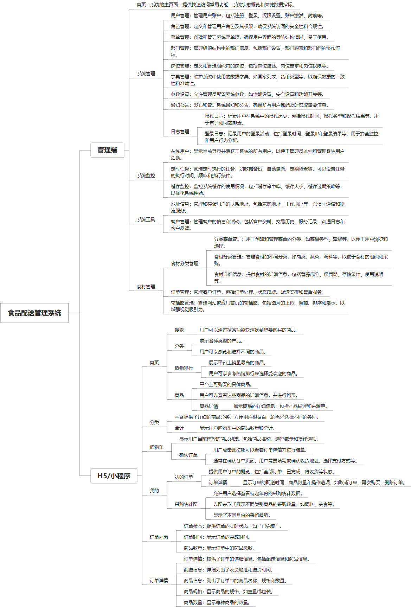

 

    
 

公司拥有上百套具有自主知识产权的软件系统，详情请查看码云首页或公司官网

 
<h1>食品配送管理系统</h1>

<a href="https://www.haishi.net.cn/">公司官网</a> ｜ <a href="https://www.haishi.net.cn/">在线体验</a>

 

## 系统介绍

餐饮食品配送，包含配送人APP、下单APP、管理端等，实现订餐、配餐，用于食品店、中央厨房等订餐、团餐业务
餐饮食品配送，包含配送人APP、下单APP、管理端等，实现订餐、配餐，用于食品店、中央厨房等订餐、团餐业务
----------------------------------------------------------------------------------------------------
本项目名称为食品配送系统，是针对食品配送场景设计开发，可以提供从食材采购到配送到客户手中的全流程管理。
本项目从用户层面可以分为两个端：管理端、H5端。
- 管理端：公司内部管理员用户使用，可以进行系统配置、用户管理、客户管理、食材管理、订单管理等。
- H5端：外部客户使用，可以浏览商品、下单、查看订单、查看采购统计等。
---
                

## 系统功能介绍

### 系统包含终端说明

管理端（WEB）、用户端（H5）、配送端（微信小程序）

| 序号 | 模块                 | 模块说明 |
| ---- | -------------------- | -------- |
| 1    | FWY-SPPS-ZYCF-MANAGE | 管理端   |
| 2    | FWY-SPPS-ZYCF-H5     | H5端     |
| 3    | FWY-SPPS-ZYCF-SERVER | 服务端   |
| 4    | FWY-SPPS-ZYCF-MP     | 小程序   |

### 系统功能结构

### 系统功能说明

- 用户管理：对系统用户进行增删改查操作，可以分配用户角色，控制用户权限。
- 食材管理：对食材信息进行管理，包括食材分类、食材名称、价格、库存等信息。
- 订单管理：对客户订单进行管理，包括订单生成、订单支付、订单配送、订单完成等流程。
- 采购统计：统计客户的采购数据，为客户提供数据分析服务。

## 系统主要界面

## 系统技术说明

### 代码模块说明

| 序号 | 目录                                                | 目录说明 |
| ---- | --------------------------------------------------- | -------- |
| 1    | FWY-SPPS-ZYCF-SERVER/px-food-distribution-api       | --       |
| 2    | FWY-SPPS-ZYCF-SERVER/px-food-distribution-service   | --       |
| 3    | FWY-SPPS-ZYCF-SERVER/px-food-distribution-framework | --       |
| 4    | FWY-SPPS-ZYCF-SERVER/px-food-distribution-quartz    | --       |
| 5    | FWY-SPPS-ZYCF-SERVER/px-food-distribution-admin     | --       |
| 6    | FWY-SPPS-ZYCF-SERVER/px-food-distribution-common    | --       |
| 7    | FWY-SPPS-ZYCF-SERVER/px-food-distribution-system    | --       |
| 8    | FWY-SPPS-ZYCF-SERVER/px-food-distribution-generator | --       |
| 9    | FWY-SPPS-ZYCF-SERVER/.idea                          | --       |

### 系统技术选型

#### 开发语言/框架

JAVA（JDK1.8）
前端框架：VUE2

#### 服务中间件

Nginx
Tomcat

#### 数据库

MySQL（5.7+）

#### 其他说明

无

## 系统演示/商用

请扫码添加客服微信获取演示地址和系统详细资料。

如果您想基于食品配送管理系统进行商业化交付或定制开发服务，我们提供有偿的技术服务支持，合作模式不限，欢迎沟通！

公司官网地址： <a href="https://www.haishi.net.cn/">https://www.haishi.net.cn</a>

联系客服获取专业回答。

## 使用须知

1、 本项目商用必须获得版权所有者的授权。

2、 未经允许本项目代码不允许二次出售。

